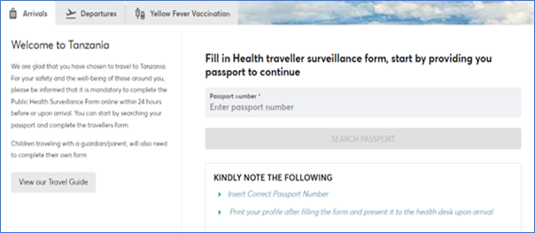

## Travelers Information

Travelers' information should be completed online at [afyamsafiri.moh.go.tz](https://afyamsafiri.moh.go.tz) based on the travel advisory. The surveillance form should be completed by both international and domestic travelers. For international travelers, it should be completed at all times 24 hours before arrival. For domestic travelers, the surveillance form should be completed during public health emergencies, 24 hours before departure. The required information is provided in part 3.1 to 3.5 of this section.

### International Traveler

Traveler entering or exiting the country. International travelers will be required to complete the e-surveillance system at all times of travel with reference to the travel advisory (TA).

### Domestic Traveler

Traveler from one location within the country to another location (Region/District) within the country. Domestic travelers will be required to complete the e-surveillance system during public emergencies only.

## 3.1. Accessing the Afyamsafiri Application

1. Open a web browser.
2. Type the URL ([https://afyamsafiri.moh.go.tz/](https://afyamsafiri.moh.go.tz/)) in your browser address bar.
3. Select language.
4. Select the “arrival” option.
5. Select the required option (domestic arrival / domestic departure / international departure / international arrival / yellow fever vaccination).

### Figure 1:
