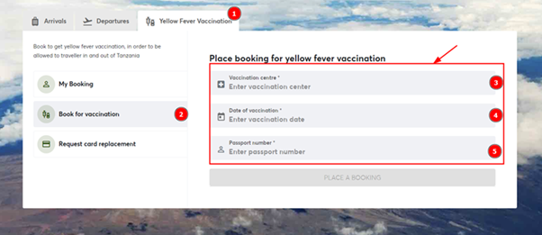
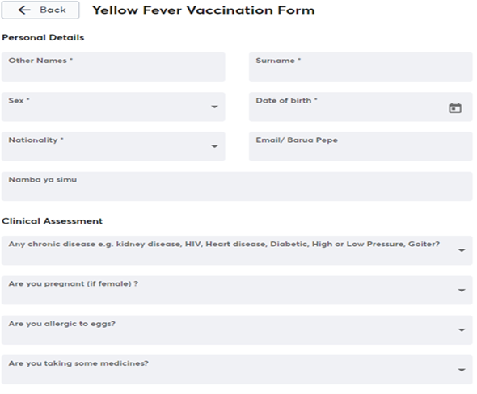
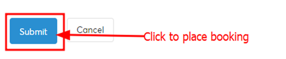
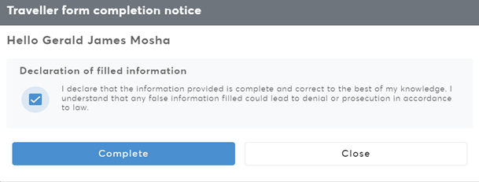

### Step 1
Open a web browser.

### Step 2
Type the URL [https://afyamsafiri.moh.go.tz/](https://afyamsafiri.moh.go.tz/) on your browser address bar.

### Step 3
Select language.

### Step 4
Select the “Yellow Fever Vaccination” service.

### Step 5
Select the vaccination center, date of vaccination, and then provide a passport number and place a booking. After this, a form will open for filling in your details.

### Step 6
Fill in the Yellow Fever Vaccination form, which consists of two main sections: Personal Details and Clinical Assessment, as shown in the figure below. Once done filling in the form appropriately, place your booking by clicking the submit button, and you will receive a notification via email about the vaccination.

### Step 7
- Click “submit” to save information. If the “submit button” is not active, review the responses and ensure all the required fields marked with an asterisk sign (*) are completed.

### Step 8
- Click the checkbox of the declaration statement and then click “complete” to save the information.

### Step 9
- Click “close” on the completion note. A QR Code will appear to signal completion.

### Step 10
- Click the National Emblem to go back to the home page.

NB: For emergency booking on a non-vaccination day, you will be required to choose future dates as emergency vaccination by declaring an emergency.

_Figure: Steps to book Yellow Fever Vaccination_

_Figure: Form for filling in details for Yellow Fever booking._

NB: If the “submit button” is not active, review the responses and ensure all the required fields marked with an asterisk sign (*) are completed.

### 3.4.1. Declaration of Filled Information

After filling all the required information, complete the declaration by clicking (✓) and then click “complete”. Filled details will be saved only when you see the form completion notice. If you click “close,” the information will be lost.

_Figure 3.2.5: Screenshot of traveler’s form completion notice (add instruction tick here)_

_Screenshot: Form completion notice and information page (click here to edit)_
