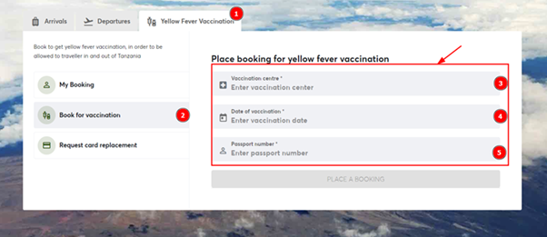
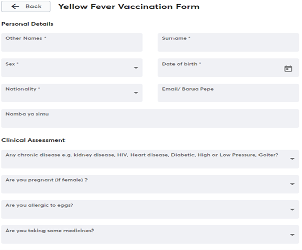
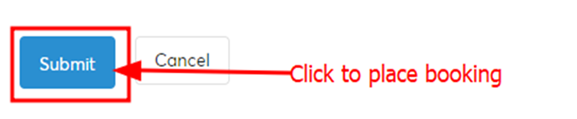

### Step 1
Open a web browser.

### Step 2
Type the URL [https://afyamsafiri.moh.go.tz/](https://afyamsafiri.moh.go.tz/) on your browser address bar.

### Step 3
Select language.

### Step 4
Select the “card replacement” service.

### Step 5
Select the vaccination center, date of vaccination, and then provide a passport number and place a booking. This will open a form for filling in your details.

### Step 6
Click “Place a booking” and the Yellow Fever Card Replacement Form will be displayed.

### Step 7
Fill in the Yellow Fever Vaccination form, which consists of two main sections: Personal Details and Clinical Assessment, as shown in the figure below. Once done filling in the form appropriately, place your booking by clicking the submit button, and you will receive a notification via email about the vaccination.

_Figure: Steps to book Yellow Fever vaccination_

### Step 8
- Click “submit” to save information. If the “submit button” is not active, review the responses and ensure all the required fields marked with an asterisk sign (*) are completed.

### Step 9
- Click the checkbox of the declaration statement and then click “complete” to save the information.

### Step 10
- Click “close” on the completion note. A QR Code will appear to signal completion.

### Step 11
- Click the National Emblem to go back to the home page.

_Figure: Form for filling in details for Yellow Fever booking._

_Figure 3.2.5: Screenshot of traveler’s form completion notice (add instruction tick here)_

_Screenshot: Form completion notice and information page (click here to edit)_

_Click the National Emblem (picha) to go back to the home page._

### Step 2